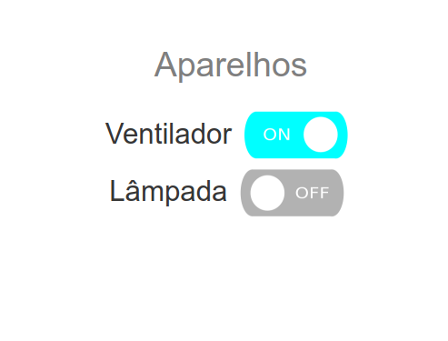
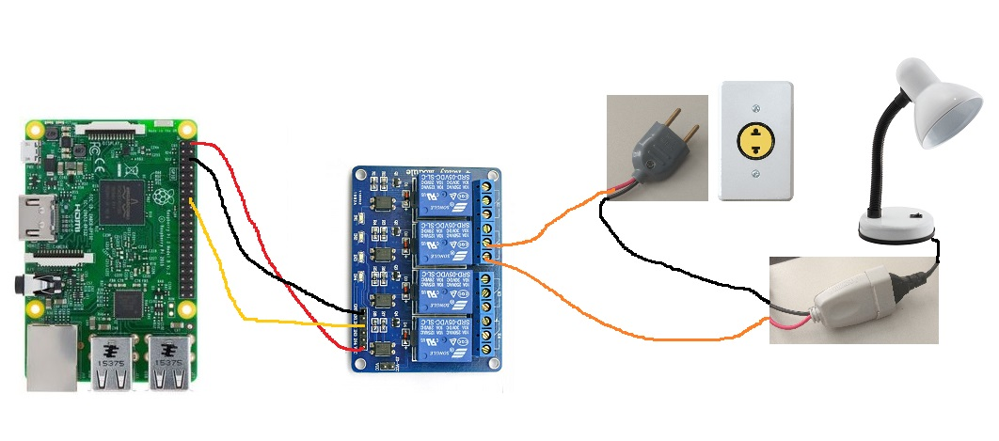

## PiHome
### Home automations with raspberry pi + Flask



### Hardware
* Raspberry pi
* Relay Module

### Setup
```bash
    $ pip install -r requirements.txt
    $ python server.py
    $ python client.py
```
Go to http://localhost:5000/ and have fun!

### Usage
The server can be any computer.

The client needs to be an raspberry pi capable of access the web address of the server.

### Circuit


### GPIO Pins


### Feel free to contribute!
